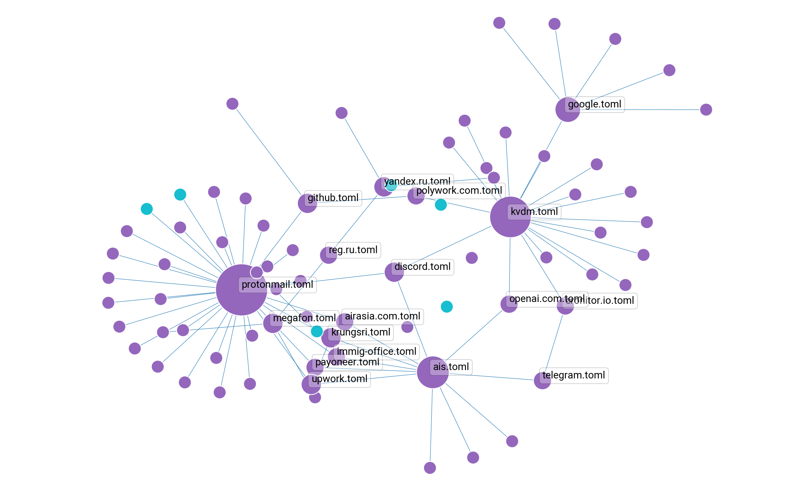

# Motivation

Having dozens of accounts and their relations require convenient management to keep them updated. Updating is manual ,therefore, the utility is auxiliary.

The [article](https://www.kvdm.dev/articles/storing-related-accounts-data-in-the-toml-files-visualization-networkx-graph/) demonstrating a real usage.

## Basic concept

Accounts are `toml` files that contain sensitive data where every file can refer to any other type of one by `reference` keyword.

## Features

1. Checking file existence and out of scope cases.
2. Visualizing the references graph and errors.

## Demonstration

Demo account files and with references and an error.

```shell
$ tree secrets
secrets
├── acc-bank.toml
├── acc-mail.toml
└── cert.pem
```

*acc-bank.toml*

```toml
login = "login"
password = "pass"
references = ["acc-mail.toml", "nonexistent.txt"]
```

*acc-mail.toml*

```toml
user = "user"
reference = "cert.pem"
```

Run checking and creating a plot.

```shell
$ python3 references.py create-plot --layout "kamada kawai" --relations --emphasize --names --dpi 400 --output-file demo.png accounts-folder
```



## TO DO

- [ ] Add per node subplots image colored in chess board way
